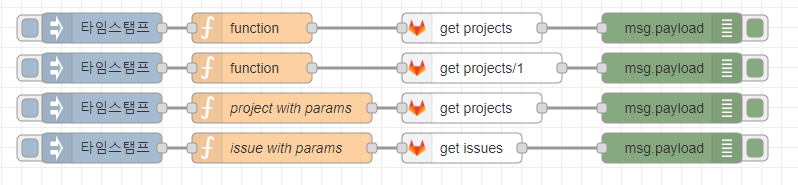

node-red-contrib-gitlabapi
================
Node-RED node for gitlabapi

## Install

To install the stable version use the `Menu - Manage palette - Install`
option and search for node-red-contrib-gitlabapi, or run the following
command in your Node-RED user directory, typically `~/.node-red`

    npm install node-red-contrib-gitlabapi

## Wrapper gitlab API   
- https://docs.gitlab.com/ee/api/

## Sample parameters
```js
// msg.method = 'get';
// msg.api = 'issues';
// msg.path = '';
msg.params = {}
// msg.params.assignee_id=1
// msg.params.author_id=5
// msg.params.labels='test'
// msg.params.state='opened'
msg.params.state='closed'
return msg;
```

## Sample Flow
You can make this json string into a flow by using the node-red flow import function.

- [sample.json](examples/sample.json)


